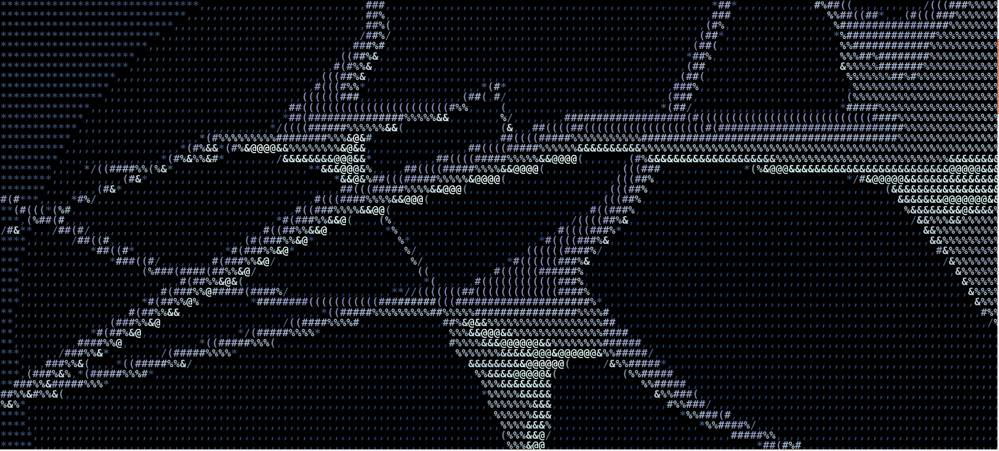

The target of the geisten project is to build intelligent systems that are minimally designed to run in tiny environments.

The geist project is a minimalistic library written in the C programming language. Our goal is to implement neural networks as efficiently as possible with as little resource consumption as necessary.

## Documentation of algorithm

The basic idea of this resource-efficient neural network is based on the principles of a binary network. The compressed 1-bit neural network allows running complex models on resource-limited devices.
But, the strong degradation of the accuracy makes it unusable for productive systems. The algorithm achieved nearly the accuracy of real-valued networks without extra computational cost.

$$ z = A * W $$

[ReActNet: Towards Precise Binary Neural Network with Generalized Activation Functions](https://arxiv.org/pdf/2003.03488.pdf)
